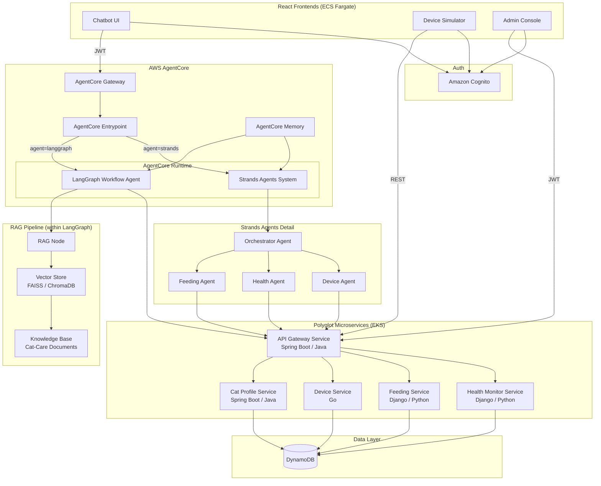
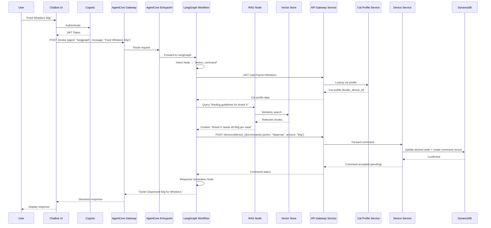
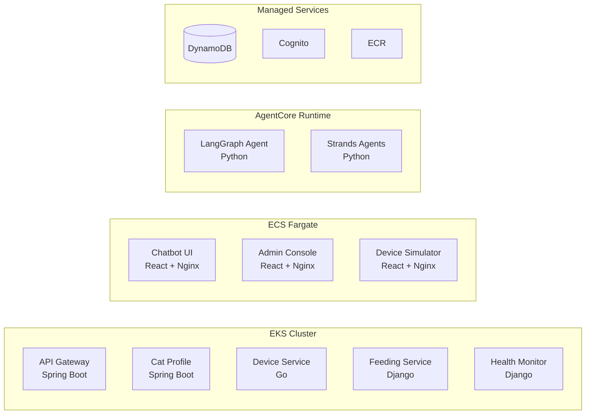

# Design Document: Smart Home Cat Demo

## Overview

Smart Home Cat Demo is an AI-first microservice demo application for managing cat-care IoT devices through natural language interaction. The system showcases three distinct AI agent patterns — LangGraph stateful workflow with embedded RAG, Strands multi-agent collaboration on AWS AgentCore, and a simple RAG pipeline — applied to a conversational agent that controls simulated cat-care devices.

The application is structured as a polyglot monorepo producing deployment artifacts (Docker images, Kubernetes manifests, ECS task definitions) targeting pre-existing AWS infrastructure provisioned by a sibling Terraform project. The backend uses Spring Boot (Java), Python Django, and Go microservices deployed on EKS, with React frontends on ECS Fargate.

### Key Design Decisions

1. **Application code only** — All AWS infrastructure (VPC, EKS, ECS, OIDC, IAM) lives in the sibling `devops-agent-demo-infra` repo. This project produces deployment artifacts only.
2. **REST-based device simulation** — Devices are data records in DynamoDB. Commands and telemetry flow through REST API calls to the Device Service. No message broker is needed.
3. **Three AI agent patterns** — LangGraph workflow (graph-based orchestration with RAG), Strands Agents (multi-agent collaboration), and a unified AgentCore entrypoint for routing between them.
4. **Polyglot microservices** — Spring Boot for API Gateway and Cat Profile, Django for Feeding and Health Monitor, Go for Device Service.
5. **Multi-compute deployment** — EKS for microservices, ECS Fargate for frontends and Device Simulator.
6. **Cognito auth** — Owner and admin roles with JWT-based access control across all frontends and APIs.

## Architecture

### High-Level Architecture



### Request Flow



### Deployment Architecture



## Components and Interfaces

### 1. LangGraph Workflow Agent (`langgraph-agent/`)

**Language:** Python  
**Framework:** LangGraph  
**Deployment:** AgentCore Runtime

The LangGraph workflow models the cat-care conversation as a directed graph with the following nodes:

| Node | Responsibility | Inputs | Outputs |
|------|---------------|--------|---------|
| `intent_node` | Classify user intent (device_command, query, knowledge, clarification) | User message, conversation state | Intent classification, extracted entities |
| `cat_profile_node` | Look up cat profile and associated devices | Cat name or ID | Cat profile data, device associations |
| `action_node` | Determine which action to take based on intent and context | Intent, cat profile, conversation state | Action plan (which service to call) |
| `device_command_node` | Execute device commands via Device Service | Device ID, command, parameters | Command result (success/failure/timeout) |
| `rag_node` | Retrieve domain knowledge from Knowledge Base | Query string | Retrieved context chunks |
| `response_node` | Generate natural language response | All accumulated context | Final response text |
| `clarification_node` | Ask user for clarification when intent is ambiguous | Ambiguous input | Clarifying question |

**Graph Edges (Conditional Routing):**
- `intent_node` → `cat_profile_node` (when intent requires cat data)
- `intent_node` → `rag_node` (when intent is knowledge query)
- `intent_node` → `clarification_node` (when intent is ambiguous)
- `cat_profile_node` → `action_node`
- `action_node` → `device_command_node` (for device commands)
- `action_node` → `rag_node` (when domain knowledge needed)
- `device_command_node` → `response_node`
- `rag_node` → `response_node`
- `clarification_node` → END (waits for user reply)

**State Schema:**
```python
class CatCareState(TypedDict):
    messages: Annotated[list, add_messages]
    intent: Optional[str]
    entities: Optional[dict]
    cat_profile: Optional[dict]
    rag_context: Optional[str]
    action_result: Optional[dict]
    needs_clarification: bool
```

**Interface:**
```python
# Invoked by AgentCore Entrypoint
async def invoke(session_id: str, message: str, agent_type: str = "langgraph") -> AsyncIterator[str]:
    """Process a user message through the LangGraph workflow and stream the response."""
```

### 2. RAG Pipeline (`langgraph-agent/rag/`)

**Language:** Python  
**Vector Store:** FAISS (local dev) / Amazon Bedrock Knowledge Base (cloud)  
**Embedding Model:** Amazon Titan Embeddings or sentence-transformers (local)

| Component | Responsibility |
|-----------|---------------|
| `document_loader` | Load and chunk cat-care documents from the Knowledge Base |
| `embedder` | Convert text chunks into vector embeddings |
| `vector_store` | Store and retrieve embeddings (FAISS locally, Bedrock KB in cloud) |
| `retriever` | Execute similarity search and return top-k relevant chunks |
| `indexer` | Incrementally index new documents without full re-index |

**Interface:**
```python
class RAGPipeline:
    async def retrieve(self, query: str, top_k: int = 5) -> list[DocumentChunk]:
        """Retrieve top-k relevant document chunks for a query."""

    async def index_document(self, document: Document) -> None:
        """Incrementally index a new document into the vector store."""

    async def reindex_all(self) -> None:
        """Full re-index of all Knowledge Base documents."""
```

**Knowledge Base Document Categories:**
- Feeding guidelines (portion sizes by breed/age/weight)
- Breed-specific dietary needs
- Health monitoring tips (normal ranges for activity, weight, litter usage)
- Device troubleshooting guides (feeder, fountain, litter box, tracker)

### 3. Strands Multi-Agent System (`strands-agents/`)

**Language:** Python  
**Framework:** Strands Agents SDK  
**Deployment:** AgentCore Runtime

| Agent | Role | Tools/Services Used |
|-------|------|-------------------|
| `Orchestrator Agent` | Classify intent, route to specialist, combine multi-domain results | All specialist agents |
| `Feeding Agent` | Handle feeding commands, schedules, history | Feeding Service, Device Service |
| `Health Agent` | Handle health queries, alerts, metrics | Health Monitor Service, Cat Profile Service |
| `Device Agent` | Handle device control, status, troubleshooting | Device Service |

**Interface:**
```python
# Each specialist agent follows this pattern
class FeedingAgent:
    def __init__(self, model, tools: list[Tool]):
        self.agent = Agent(model=model, tools=tools, system_prompt=FEEDING_SYSTEM_PROMPT)

    async def handle(self, request: str, context: dict) -> str:
        """Process a feeding-related request."""
```

**Orchestrator Routing Logic:**
```python
class OrchestratorAgent:
    async def route(self, message: str, session_id: str) -> str:
        """Classify intent and route to appropriate specialist agent(s).
        For multi-domain requests, coordinate across agents and combine results.
        On specialist error, return descriptive error message."""
```

### 4. AgentCore Entrypoint

**Deployment:** AgentCore Gateway

| Endpoint | Method | Description |
|----------|--------|-------------|
| `/invoke` | POST | Route request to selected agent implementation |
| `/agents` | GET | List available agent implementations |

**Request Schema:**
```json
{
  "session_id": "string",
  "agent_type": "langgraph | strands",
  "message": "string"
}
```

**Routing Logic:**
- `agent_type = "langgraph"` → Forward to LangGraph Workflow
- `agent_type = "strands"` → Forward to Strands Orchestrator Agent
- Missing/invalid `agent_type` → Return error with available options
- JWT token from Cognito passed through without modification

### 5. API Gateway Service (`services/api-gateway/`)

**Language:** Java  
**Framework:** Spring Boot  
**Deployment:** EKS

| Endpoint Pattern | Downstream Service | Description |
|-----------------|-------------------|-------------|
| `/api/cats/**` | Cat Profile Service | Cat profile CRUD |
| `/api/devices/**` | Device Service | Device registration and state |
| `/api/feeding/**` | Feeding Service | Feeding schedules and history |
| `/api/health/**` | Health Monitor Service | Health metrics and alerts |

**Responsibilities:**
- JWT validation (reject 401 for missing/invalid tokens, 403 for insufficient role)
- Request routing to downstream microservices
- Trace context header propagation (W3C Trace Context)
- Rate limiting and request logging

### 6. Cat Profile Service (`services/cat-profile/`)

**Language:** Java  
**Framework:** Spring Boot  
**Deployment:** EKS  
**Storage:** DynamoDB

**Endpoints:**

| Endpoint | Method | Description |
|----------|--------|-------------|
| `/cats` | POST | Create cat profile |
| `/cats/{id}` | GET | Get cat profile |
| `/cats/{id}` | PUT | Update cat profile |
| `/cats` | GET | List cats (with owner filter) |
| `/cats/{id}/health` | GET | Get cat health summary |

### 7. Device Service (`services/device/`)

**Language:** Go  
**Deployment:** EKS  
**Storage:** DynamoDB

**Endpoints:**

| Endpoint | Method | Description |
|----------|--------|-------------|
| `/devices` | POST | Register device |
| `/devices/{id}` | GET | Get device (including shadow state) |
| `/devices/{id}` | PUT | Update device configuration |
| `/devices` | GET | List devices |
| `/devices/{id}/shadow` | GET | Get device shadow (desired + reported) |
| `/devices/{id}/shadow` | PUT | Update desired state |

### 8. Feeding Service (`services/feeding/`)

**Language:** Python  
**Framework:** Django  
**Deployment:** EKS  
**Storage:** DynamoDB

**Endpoints:**

| Endpoint | Method | Description |
|----------|--------|-------------|
| `/feeding/schedules` | POST | Create feeding schedule |
| `/feeding/schedules/{cat_id}` | GET | Get schedules for a cat |
| `/feeding/schedules/{id}` | PUT | Update schedule |
| `/feeding/history/{cat_id}` | GET | Get feeding history (with time range) |
| `/feeding/dispense` | POST | Trigger immediate feeding |

**Scheduled Feeding Logic:**
- Celery beat (or Django-Q) checks schedules every minute
- On schedule match: invoke Device Service to update feeder's desired state to dispense
- On device offline: retry 3× at 60s intervals, then generate alert
- Duplicate prevention: reject feed if cat was fed within configurable minimum interval

### 9. Health Monitor Service (`services/health-monitor/`)

**Language:** Python  
**Framework:** Django  
**Deployment:** EKS  
**Storage:** DynamoDB

**Endpoints:**

| Endpoint | Method | Description |
|----------|--------|-------------|
| `/health/{cat_id}/summary` | GET | Aggregated health summary |
| `/health/{cat_id}/alerts` | GET | Active health alerts |
| `/health/{cat_id}/metrics` | GET | Raw health metrics (with time range) |
| `/health/alerts` | GET | All active alerts (admin) |

**Telemetry Aggregation:**
- Reads telemetry records from DynamoDB (written by Device Simulator via Device Service)
- Aggregates into per-cat health summaries
- Generates alerts when metrics deviate beyond configurable thresholds

### 10. Device Service Command Handling (`services/device/`)

The Device Service handles device commands via REST endpoints in addition to its CRUD responsibilities (described in component 7 above).

**Command Endpoints:**

| Endpoint | Method | Description |
|----------|--------|-------------|
| `/devices/{id}/commands` | POST | Submit a device command (updates desired state) |
| `/devices/{id}/commands/{cmd_id}` | GET | Get command status |
| `/devices/{id}/commands` | GET | List recent commands for a device |
| `/devices/{id}/commands/{cmd_id}/ack` | POST | Acknowledge a command (used by Device Simulator) |

**Command Flow:**
1. Caller sends `POST /devices/{id}/commands` with action and params
2. Device Service creates a command record (status: `pending`) and updates the device's desired state in DynamoDB
3. Device Simulator polls `GET /devices/{id}/commands?status=pending` to discover new commands
4. Device Simulator processes the command, updates reported state, and calls `POST /devices/{id}/commands/{cmd_id}/ack`
5. If no ack within 10 seconds, a background process marks the command as `timed_out`

**Command Record Schema:**
```go
type CommandRecord struct {
    CommandID  string            `json:"command_id"`
    DeviceID   string            `json:"device_id"`
    Action     string            `json:"action"`
    Params     map[string]string `json:"params"`
    Status     string            `json:"status"` // "pending", "acknowledged", "timed_out", "failed"
    CreatedAt  string            `json:"created_at"`
    AckedAt    string            `json:"acked_at,omitempty"`
}
```

### 11. Device Simulator (`device-simulator/`)

**Language:** TypeScript/React  
**Deployment:** ECS Fargate

**Simulated Device Types:**

| Device Type | Telemetry Published | Commands Accepted |
|-------------|-------------------|-------------------|
| Automatic Feeder | Feeding events, food level | Dispense, set portion |
| Water Fountain | Water level, filter status | Refill alert, set flow |
| Litter Box Monitor | Usage events, fill level | Reset counter |
| Activity Tracker | Steps, active minutes, sleep | Set tracking mode |

**Behavior:**
- Polls Device Service for pending commands and acknowledges them via REST
- Publishes periodic telemetry by writing records to Device Service via REST at configurable intervals
- Simulates fault conditions (low food, empty water, full litter box) by creating alert records via Health Monitor Service REST API
- React UI displays real-time device states and telemetry

### 12. Chatbot UI (`chatbot/`)

**Language:** TypeScript/React  
**Deployment:** ECS Fargate

**Features:**
- Cognito authentication (redirect to login if unauthenticated)
- Agent selection toggle (LangGraph vs Strands)
- Real-time streamed response display
- Scrollable conversation history
- Connection status indicator with auto-retry

### 13. Admin Console (`admin-console/`)

**Language:** TypeScript/React  
**Deployment:** ECS Fargate

**Features:**
- Cognito authentication with admin role verification
- Dashboard: device status, microservice health, agent status
- Device management: register, view state, telemetry, command history
- Cat profile management: view, edit profiles

### 14. CI/CD Pipeline (`.github/workflows/`)

**Workflows:**

| Workflow | Trigger | Actions |
|----------|---------|---------|
| `ci.yml` | Pull request | Lint, unit test, build validation |
| `deploy-services.yml` | Push to main | Build images → push to ECR → deploy to EKS |
| `deploy-frontends.yml` | Push to main | Build images → push to ECR → deploy to ECS |
| `deploy-agents.yml` | Push to main | Build agent packages → deploy to AgentCore |

**OIDC Authentication:**
- All workflows use `aws-actions/configure-aws-credentials` with OIDC
- IAM OIDC provider and roles provisioned by sibling infra project
- No AWS access keys stored in GitHub secrets

## Data Models

### Cat Profile (DynamoDB: `cat-profiles`)

| Attribute | Type | Description |
|-----------|------|-------------|
| `cat_id` (PK) | String (UUID) | Unique cat identifier |
| `owner_id` (GSI) | String | Cognito user ID of the owner |
| `name` | String | Cat name (required) |
| `breed` | String | Cat breed |
| `age_months` | Number | Age in months |
| `weight_kg` | Number | Current weight in kg (required) |
| `dietary_restrictions` | List[String] | Dietary restrictions |
| `assigned_devices` | Map | Device IDs mapped by type |
| `created_at` | String (ISO 8601) | Creation timestamp |
| `updated_at` | String (ISO 8601) | Last update timestamp |

### Device (DynamoDB: `devices`)

| Attribute | Type | Description |
|-----------|------|-------------|
| `device_id` (PK) | String (UUID) | Unique device identifier |
| `device_type` | String | feeder, fountain, litter_box, tracker |
| `name` | String | Human-readable device name |
| `status` | String | online, offline, error |
| `desired_state` | Map | Desired device state (shadow) |
| `reported_state` | Map | Last reported device state (shadow) |
| `assigned_cat_id` | String | Cat this device is assigned to |
| `config` | Map | Device-specific configuration |
| `last_seen` | String (ISO 8601) | Last telemetry timestamp |
| `created_at` | String (ISO 8601) | Registration timestamp |

### Feeding Schedule (DynamoDB: `feeding-schedules`)

| Attribute | Type | Description |
|-----------|------|-------------|
| `schedule_id` (PK) | String (UUID) | Unique schedule identifier |
| `cat_id` (GSI) | String | Associated cat |
| `device_id` | String | Assigned feeder device |
| `meal_times` | List[String] | Cron expressions or HH:MM times |
| `portion_grams` | Number | Portion size in grams |
| `dietary_constraints` | Map | Constraints (max daily, min interval) |
| `enabled` | Boolean | Whether schedule is active |
| `created_at` | String (ISO 8601) | Creation timestamp |

### Feeding Event (DynamoDB: `feeding-events`)

| Attribute | Type | Description |
|-----------|------|-------------|
| `event_id` (PK) | String (UUID) | Unique event identifier |
| `cat_id` (GSI) | String | Cat that was fed |
| `device_id` | String | Feeder device used |
| `portion_dispensed_grams` | Number | Actual portion dispensed |
| `trigger` | String | scheduled, manual, agent |
| `status` | String | success, failed, timeout |
| `timestamp` (SK) | String (ISO 8601) | Event timestamp |

### Health Metric (DynamoDB: `health-metrics`)

| Attribute | Type | Description |
|-----------|------|-------------|
| `cat_id` (PK) | String | Associated cat |
| `timestamp` (SK) | String (ISO 8601) | Metric timestamp |
| `metric_type` | String | weight, activity, litter_usage |
| `value` | Number | Metric value |
| `device_id` | String | Source device |
| `metadata` | Map | Additional metric-specific data |

### Health Alert (DynamoDB: `health-alerts`)

| Attribute | Type | Description |
|-----------|------|-------------|
| `alert_id` (PK) | String (UUID) | Unique alert identifier |
| `cat_id` (GSI) | String | Associated cat |
| `alert_type` | String | weight_change, low_activity, litter_anomaly |
| `severity` | String | info, warning, critical |
| `message` | String | Human-readable alert description |
| `threshold_config` | Map | Threshold that was exceeded |
| `acknowledged` | Boolean | Whether alert has been acknowledged |
| `created_at` | String (ISO 8601) | Alert creation timestamp |

### Device Command (DynamoDB: `device-commands`)

| Attribute | Type | Description |
|-----------|------|-------------|
| `command_id` (PK) | String (UUID) | Unique command identifier |
| `device_id` (GSI) | String | Target device |
| `action` | String | dispense, set_portion, refill, reset, set_mode |
| `params` | Map | Action-specific parameters |
| `status` | String | pending, acknowledged, timed_out, failed |
| `created_at` | String (ISO 8601) | Command creation timestamp |
| `acked_at` | String (ISO 8601) | Acknowledgment timestamp (if acked) |

### Device Telemetry (DynamoDB: `device-telemetry`)

| Attribute | Type | Description |
|-----------|------|-------------|
| `device_id` (PK) | String | Source device |
| `timestamp` (SK) | String (ISO 8601) | Telemetry timestamp |
| `device_type` | String | feeder, fountain, litter_box, tracker |
| `metrics` | Map | Device-specific metrics (e.g., food_level_pct, water_level_pct) |


## Correctness Properties

*A property is a characteristic or behavior that should hold true across all valid executions of a system — essentially, a formal statement about what the system should do. Properties serve as the bridge between human-readable specifications and machine-verifiable correctness guarantees.*

### Property 1: LangGraph intent-based routing

*For any* intent classification (device_command, query, knowledge, clarification), the LangGraph workflow SHALL route the request through the correct node sequence — device commands through the device command execution node, queries through the cat profile lookup node, knowledge requests through the RAG node, and ambiguous intents through the clarification node.

**Validates: Requirements 1.3, 1.4, 1.5**

### Property 2: LangGraph state persistence across nodes

*For any* state key-value pair set by a node in the LangGraph workflow, all subsequent nodes in the same session SHALL have access to that state value without modification.

**Validates: Requirements 1.7**

### Property 3: RAG retrieval returns bounded, ordered results

*For any* query string and a seeded vector store, the RAG pipeline SHALL return at most top-k document chunks, and the returned chunks SHALL be ordered by descending relevance score.

**Validates: Requirements 2.2**

### Property 4: Incremental RAG indexing preserves existing documents

*For any* new document added to the Knowledge Base, all previously indexed documents SHALL remain retrievable with unchanged relevance scores for their original queries, AND the new document SHALL become retrievable for relevant queries.

**Validates: Requirements 2.6**

### Property 5: Strands Orchestrator routes to correct specialist

*For any* user request with a classifiable intent (feeding, health, device), the Orchestrator Agent SHALL route the request to the corresponding specialist agent (Feeding Agent, Health Agent, or Device Agent respectively).

**Validates: Requirements 3.2**

### Property 6: Strands Orchestrator returns descriptive errors on specialist failure

*For any* specialist agent that encounters an error during request processing, the Orchestrator Agent SHALL return a non-empty error message to the user that contains context about which agent failed and what went wrong, rather than failing silently.

**Validates: Requirements 3.9**

### Property 7: AgentCore Entrypoint routes to correct agent implementation

*For any* valid agent selection parameter ("langgraph" or "strands"), the AgentCore Entrypoint SHALL forward the request to the corresponding agent implementation (LangGraph Workflow or Strands Orchestrator Agent respectively).

**Validates: Requirements 4.1, 4.2, 4.3**

### Property 8: AgentCore Entrypoint rejects invalid agent selection

*For any* request with a missing or invalid agent selection parameter (any string other than "langgraph" or "strands"), the AgentCore Entrypoint SHALL return an error response that lists the available agent implementations.

**Validates: Requirements 4.4**

### Property 9: AgentCore JWT passthrough

*For any* JWT token string included in an incoming request, the AgentCore Entrypoint SHALL forward the identical token to the downstream agent implementation without modification.

**Validates: Requirements 4.5**

### Property 10: Cat profile round-trip persistence

*For any* valid cat profile (with name and weight present), storing the profile via the Cat Profile Service and then retrieving it SHALL return a profile with all fields (name, breed, age, weight, dietary restrictions, owner association) matching the original.

**Validates: Requirements 8.1**

### Property 11: Cat profile validation rejects missing required fields

*For any* cat profile missing the `name` field or the `weight` field (or both), the Cat Profile Service SHALL reject the create/update request and return a descriptive error identifying the missing field(s).

**Validates: Requirements 8.2**

### Property 12: Health telemetry aggregation correctness

*For any* set of telemetry data points for a given cat, the Health Monitor Service SHALL produce a per-cat health summary where aggregated values (averages, counts, min/max) are mathematically consistent with the input data points.

**Validates: Requirements 8.3**

### Property 13: Health alert threshold detection

*For any* health metric value and configurable threshold, the Health Monitor Service SHALL generate a health alert if and only if the metric value deviates beyond the threshold. Values within the threshold SHALL NOT produce alerts.

**Validates: Requirements 8.4**

### Property 14: Feeding schedule round-trip persistence

*For any* valid feeding schedule (with cat_id, device_id, meal times, and portion size), storing the schedule via the Feeding Service and then retrieving it SHALL return a schedule with all fields matching the original.

**Validates: Requirements 8.5**

### Property 15: Feeding event recording round-trip

*For any* completed feeding event, the Feeding Service SHALL record the event such that retrieving the feeding history for that cat and time range returns an event with matching timestamp, portion dispensed, device used, and cat fed.

**Validates: Requirements 9.2**

### Property 16: Feeding history query filtering

*For any* cat_id and time range, the Feeding Service SHALL return only feeding events that match both the specified cat_id AND fall within the specified time range. No events for other cats or outside the time range SHALL be included.

**Validates: Requirements 9.4**

### Property 17: Duplicate feeding prevention

*For any* two feed commands for the same cat where the second command occurs within the configurable minimum interval after the first, the Feeding Service SHALL reject the second command. Commands outside the minimum interval SHALL be accepted.

**Validates: Requirements 9.5**

### Property 18: Device command round-trip

*For any* valid device command (with device_id, action, and params), submitting the command via the Device Service and then retrieving the command record SHALL return a record with matching device_id, action, params, and a status of "pending" or "acknowledged".

**Validates: Requirements 10.1, 10.2**

### Property 19: Device shadow round-trip

*For any* device with desired and reported state maps, updating the device shadow via the Device Service and then retrieving it SHALL return a shadow where both the desired state and reported state match the values that were set.

**Validates: Requirements 10.5**

### Property 20: API Gateway request path routing

*For any* incoming request with a path matching a known pattern (`/api/cats/**`, `/api/devices/**`, `/api/feeding/**`, `/api/health/**`), the API Gateway Service SHALL route the request to the correct downstream microservice (Cat Profile, Device, Feeding, or Health Monitor respectively).

**Validates: Requirements 11.4**

### Property 21: Trace context header propagation

*For any* incoming request containing W3C Trace Context headers (`traceparent`, `tracestate`), the API Gateway Service SHALL include those same headers in the downstream request to the target microservice.

**Validates: Requirements 11.5**

### Property 22: Invalid JWT rejection

*For any* request arriving at the API Gateway Service without a valid JWT token (missing, expired, or malformed), the service SHALL respond with HTTP 401 Unauthorized.

**Validates: Requirements 14.4**

### Property 23: Non-admin role rejection on admin endpoints

*For any* request with a valid JWT token that does not contain the "admin" role, when sent to an admin-only endpoint, the API Gateway Service SHALL respond with HTTP 403 Forbidden.

**Validates: Requirements 14.5**

## Error Handling

### AI Agent Errors

| Error Scenario | Handling Strategy | User-Facing Behavior |
|---------------|-------------------|---------------------|
| LLM API timeout/failure | Retry once with exponential backoff; if still failing, return graceful error | "I'm having trouble processing your request. Please try again in a moment." |
| Intent classification failure | Route to clarification node | "I'm not sure what you'd like me to do. Could you rephrase that?" |
| RAG retrieval returns no results | Proceed without context; note in response that no specific guidance was found | Response generated without domain context, with disclaimer |
| Specialist agent error (Strands) | Orchestrator catches error, returns descriptive message | "The feeding system encountered an issue: [error detail]. Please try again." |
| AgentCore Memory unavailable | Continue without conversation history; log warning | Agent responds without prior context; no user-visible error |

### Microservice Errors

| Error Scenario | Handling Strategy | HTTP Response |
|---------------|-------------------|---------------|
| Downstream service unavailable | API Gateway returns 503 with retry-after header | 503 Service Unavailable |
| Invalid request payload | Service validates and returns descriptive error | 400 Bad Request with field-level errors |
| Missing/invalid JWT | API Gateway rejects before routing | 401 Unauthorized |
| Insufficient permissions | API Gateway checks role before routing | 403 Forbidden |
| DynamoDB throttling | Exponential backoff with jitter (3 retries) | 503 if all retries fail |
| Cat profile not found | Return 404 with descriptive message | 404 Not Found |

### Device Command Errors

| Error Scenario | Handling Strategy | Outcome |
|---------------|-------------------|---------|
| Device Service unreachable | Calling service receives connection error, retries with backoff | Command marked as failed after retries |
| Device command timeout (>10s no ack) | Background process marks command as timed_out | Calling service receives timeout status |
| Device offline at scheduled feeding | Retry 3× at 60s intervals; generate alert after all retries fail | Alert created in health alerts table |
| Invalid command parameters | Device Service validates and rejects with 400 | No state change; descriptive error returned |
| Duplicate feeding within minimum interval | Reject command, return descriptive error | 409 Conflict with explanation |

### Frontend Errors

| Error Scenario | Handling Strategy | User-Facing Behavior |
|---------------|-------------------|---------------------|
| AgentCore Gateway disconnection | Display connection indicator, auto-retry with backoff | Yellow/red status indicator; auto-reconnect |
| Cognito token expiration | Silently refresh token; if refresh fails, redirect to login | Seamless refresh or login redirect |
| API request failure | Display error toast with retry option | "Something went wrong. Tap to retry." |
| Streaming response interruption | Display partial response with "interrupted" indicator | Partial message shown with retry option |

## Testing Strategy

### Testing Approach

This project uses a dual testing approach combining unit tests with property-based tests for comprehensive coverage:

- **Unit tests** verify specific examples, edge cases, error conditions, and integration points
- **Property-based tests** verify universal properties across randomly generated inputs (minimum 100 iterations per property)
- **Integration tests** verify cross-service communication and external service behavior
- **Smoke tests** verify deployment configuration and structural requirements

### Property-Based Testing Configuration

**Libraries by language:**
- **Python** (LangGraph agent, Strands agents, Django services): [Hypothesis](https://hypothesis.readthedocs.io/)
- **Java** (Spring Boot services): [jqwik](https://jqwik.net/)
- **Go** (Device service): [rapid](https://github.com/flyingmutant/rapid)
- **TypeScript** (React frontends): [fast-check](https://github.com/dubzzz/fast-check)

**Configuration:**
- Minimum 100 iterations per property test
- Each property test tagged with: `Feature: smart-home-cat-demo, Property {number}: {property_text}`
- Property tests run as part of the CI pipeline on every PR

### Test Distribution by Component

| Component | Unit Tests | Property Tests | Integration Tests | Smoke Tests |
|-----------|-----------|---------------|-------------------|-------------|
| LangGraph Agent | Intent classification, node logic | Properties 1-4 (routing, state, RAG) | End-to-end workflow with mocked services | Graph structure verification |
| Strands Agents | Individual agent logic | Properties 5-6 (routing, error handling) | Multi-agent coordination | Agent registry |
| AgentCore Entrypoint | — | Properties 7-9 (routing, errors, JWT) | Gateway integration | — |
| Cat Profile Service | CRUD operations, edge cases | Properties 10-11 (round-trip, validation) | DynamoDB integration | — |
| Health Monitor Service | Metric processing | Properties 12-13 (aggregation, thresholds) | Telemetry pipeline | — |
| Feeding Service | Schedule logic, edge cases | Properties 14-17 (round-trip, filtering, duplicates) | Scheduler + Device Service integration | — |
| Device Service | CRUD, shadow logic, command handling | Properties 18-19 (command round-trip, shadow) | DynamoDB integration | — |
| API Gateway Service | Route matching | Properties 20-23 (routing, headers, auth) | Downstream service integration | Health probes |
| React Frontends | Component rendering, interactions | — | Cognito auth flow | — |
| CI/CD Pipelines | — | — | — | Workflow structure, OIDC config |
| Deployment Artifacts | — | — | Build produces artifacts | Dockerfile, manifest existence |

### Local Development Testing

The Docker Compose local development setup enables end-to-end testing without AWS dependencies:

```yaml
# docker-compose.yml services for local testing
services:
  dynamodb-local:   # DynamoDB local
  api-gateway:      # Spring Boot
  cat-profile:      # Spring Boot
  device-service:   # Go
  feeding-service:  # Django
  health-monitor:   # Django
  langgraph-agent:  # Python LangGraph
  strands-agents:   # Python Strands
  chatbot-ui:       # React
  device-simulator: # React
  admin-console:    # React
```

Integration tests run against this local stack. Property tests run in isolation with mocked dependencies.
