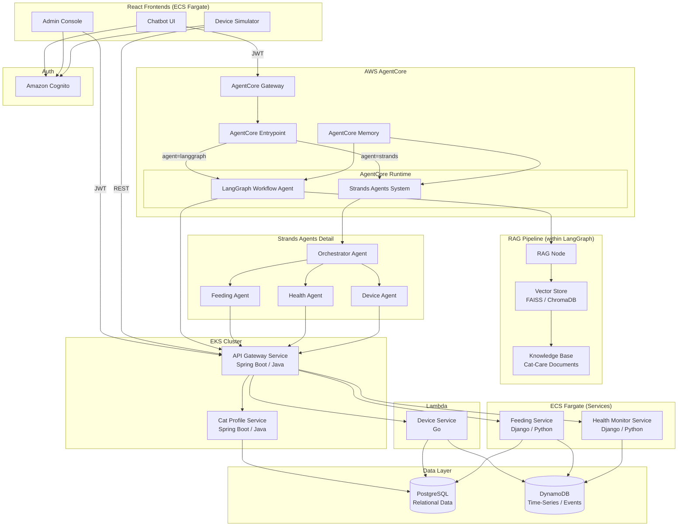

# Smart Home Cat Demo

An AI-first microservice demo application for managing cat-care IoT devices through natural language interaction. The system showcases three distinct AI agent patterns applied to a conversational agent that controls simulated cat-care devices (feeders, water fountains, litter box monitors, activity trackers).

## AI Agent Patterns

This project demonstrates three AI agent design patterns side by side:

### 1. LangGraph Stateful Workflow with RAG (`langgraph-agent/`)

A Python-based stateful workflow agent built with [LangGraph](https://github.com/langchain-ai/langgraph) that orchestrates cat-care operations as a directed graph of nodes. The workflow includes:

- **Intent Node** — classifies user intent (device command, query, knowledge, clarification)
- **Cat Profile Node** — looks up cat profiles and associated devices
- **Action Node** — determines which backend action to take
- **Device Command Node** — executes device commands via the Device Service
- **RAG Node** — retrieves domain knowledge from the Knowledge Base (feeding guidelines, breed-specific dietary needs, health tips, device troubleshooting)
- **Response Node** — generates natural language responses using accumulated context
- **Clarification Node** — asks the user for clarification when intent is ambiguous

The embedded RAG pipeline (`langgraph-agent/rag/`) uses FAISS locally (or Amazon Bedrock Knowledge Base in the cloud) to index and retrieve cat-care domain documents.

### 2. Strands Multi-Agent Collaboration (`strands-agents/`)

A Python-based multi-agent system built with the [Strands Agents SDK](https://github.com/strands-agents/sdk-python) where specialized agents handle different domains:

| Agent | Role |
|-------|------|
| **Orchestrator Agent** | Classifies intent, routes to specialists, combines multi-domain results |
| **Feeding Agent** | Handles feeding commands, schedules, and history |
| **Health Agent** | Handles health queries, alerts, and metrics |
| **Device Agent** | Handles device control, status, and troubleshooting |

The Orchestrator coordinates across specialists for multi-domain requests (e.g., "feed my cat and check her health") and returns descriptive errors when a specialist fails.

### 3. AgentCore Entrypoint Routing

A unified entrypoint deployed on AWS AgentCore Gateway that routes requests to either the LangGraph Workflow or the Strands multi-agent system based on an `agent_type` parameter (`"langgraph"` or `"strands"`). JWT tokens from Cognito are passed through without modification.

## Architecture

### High-Level Architecture



### Compute Distribution

Services are distributed across four AWS compute types to showcase each:

| Compute Platform | Services | Technology |
|-----------------|----------|------------|
| **EKS** (Kubernetes) | API Gateway Service, Cat Profile Service | Spring Boot / Java |
| **ECS Fargate** | Feeding Service, Health Monitor Service, Chatbot UI, Device Simulator, Admin Console | Django / Python (services), React / TypeScript (frontends) |
| **Lambda** | Device Service | Go |
| **AgentCore Runtime** | LangGraph Workflow Agent, Strands Agents System | Python |

### Dual Storage Pattern (Polyglot Persistence)

The system demonstrates combining a relational database with a NoSQL store:

| Storage | Purpose | Used By |
|---------|---------|---------|
| **PostgreSQL** | Relational/structured data — cat profiles (JPA/Hibernate), feeding schedules (Django ORM), device registry (pgx/sqlx) | Cat Profile Service, Feeding Service, Device Service |
| **DynamoDB** | High-throughput time-series/event data — device telemetry, device commands, device shadow, feeding events, health metrics, health alerts | Device Service, Feeding Service, Health Monitor Service |

Each service uses a language-idiomatic driver: Spring Boot uses JPA/Hibernate, Django uses Django ORM, and Go uses pgx/sqlx for PostgreSQL. All services use boto3 or the AWS SDK for DynamoDB.

## Project Structure

```
smart-home-cat-demo/
├── langgraph-agent/          # LangGraph Workflow Agent (Python)
│   └── rag/                  # RAG Pipeline — document loading, embedding, retrieval
├── strands-agents/           # Strands Multi-Agent System (Python)
├── chatbot/                  # Chatbot UI (React / TypeScript)
├── device-simulator/         # Device Simulator UI (React / TypeScript)
├── admin-console/            # Admin Console UI (React / TypeScript)
├── services/
│   ├── api-gateway/          # API Gateway Service (Spring Boot / Java) → EKS
│   ├── cat-profile/          # Cat Profile Service (Spring Boot / Java) → EKS
│   ├── device/               # Device Service (Go) → Lambda
│   ├── feeding/              # Feeding Service (Django / Python) → ECS Fargate
│   └── health-monitor/       # Health Monitor Service (Django / Python) → ECS Fargate
├── deploy/
│   ├── k8s/                  # Kubernetes manifests for EKS deployments
│   ├── ecs/                  # ECS task definitions for Fargate deployments
│   └── lambda/               # Lambda deployment configuration
├── .github/workflows/        # GitHub Actions CI/CD pipelines
├── docker-compose.yml        # Local development setup
└── README.md                 # This file
```

## Prerequisites

- **Docker** and **Docker Compose** — for local development
- **Java 17+** — for Spring Boot services (API Gateway, Cat Profile)
- **Python 3.11+** — for Django services (Feeding, Health Monitor) and AI agents (LangGraph, Strands)
- **Go 1.21+** — for the Device Service
- **Node.js 18+** and **npm** — for React frontends (Chatbot, Device Simulator, Admin Console)
- **AWS CLI** — for cloud deployment and configuration

## Getting Started

### Local Development

1. **Clone the repository:**

   ```bash
   git clone <repository-url>
   cd smart-home-cat-demo
   ```

2. **Start the local stack with Docker Compose:**

   ```bash
   docker-compose up -d
   ```

   This starts all microservices, frontends, PostgreSQL, and DynamoDB Local for end-to-end testing without AWS dependencies.

3. **Access the applications:**

   | Application | URL |
   |-------------|-----|
   | Chatbot UI | `http://localhost:3000` |
   | Device Simulator | `http://localhost:3001` |
   | Admin Console | `http://localhost:3002` |
   | API Gateway | `http://localhost:8080` |

### Building Individual Components

Each component can be built independently:

```bash
# Spring Boot services (API Gateway, Cat Profile)
cd services/api-gateway && ./mvnw package
cd services/cat-profile && ./mvnw package

# Django services (Feeding, Health Monitor)
cd services/feeding && pip install -r requirements.txt
cd services/health-monitor && pip install -r requirements.txt

# Go service (Device)
cd services/device && go build -o device-service ./cmd/...

# React frontends
cd chatbot && npm install && npm run build
cd device-simulator && npm install && npm run build
cd admin-console && npm install && npm run build

# AI agents
cd langgraph-agent && pip install -r requirements.txt
cd strands-agents && pip install -r requirements.txt
```

### Running Tests

```bash
# Java property tests (jqwik) and unit tests
cd services/api-gateway && ./mvnw test
cd services/cat-profile && ./mvnw test

# Python property tests (Hypothesis) and unit tests
cd services/feeding && pytest
cd services/health-monitor && pytest
cd langgraph-agent && pytest
cd strands-agents && pytest

# Go property tests (rapid) and unit tests
cd services/device && go test ./...

# TypeScript unit tests
cd chatbot && npm test
cd device-simulator && npm test
cd admin-console && npm test
```

## Infrastructure

All AWS infrastructure (VPC, EKS cluster, ECS services, Lambda functions, Cognito, OIDC provider, IAM roles) is provisioned by the sibling infrastructure project:

**[`my-solution-hub/devops-agent-demo-infra`](https://github.com/my-solution-hub/devops-agent-demo-infra)**

This repository contains **application code only** — it produces deployment artifacts (Docker images, Kubernetes manifests, ECS task definitions, Lambda deployment packages) that target the pre-existing infrastructure. Deployment configuration files in the `deploy/` directory reference environment-specific variables (VPC IDs, subnet IDs, cluster names) provided by the infra project.

## Authentication

The system uses Amazon Cognito for authentication with two user roles:

- **Owner** — cat owners who interact with the Chatbot UI and Device Simulator
- **Admin** — administrators who access the Admin Console and management endpoints

All frontends authenticate via Cognito and include JWT tokens in API requests. The API Gateway Service validates JWTs and enforces role-based access control (401 for missing/invalid tokens, 403 for insufficient role).

## License

See [LICENSE](LICENSE) for details.
